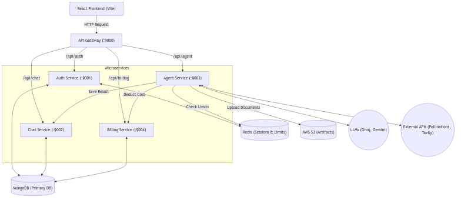

# E.D.I.T.H. AI System Architecture

This document provides a comprehensive overview of the E.D.I.T.H. AI architecture, detailing the microservices structure, frontend configuration, and infrastructure.

## 1. High-Level Overview

E.D.I.T.H. AI uses a **Node.js Microservices Architecture** for the backend and a **React (Vite)** frontend. The system relies on **Redis** for stateful session management and rate limiting, while **MongoDB** serves as the primary persistence layer.

### Architecture Diagram

### System Flow
1. User requests are intercepted by the **API Gateway** on Port 9000.
2. The Gateway checks authentication via session cookies.
3. Requests are securely proxied to the target microservice (`Auth`, `Chat`, `Agent`, `Billing`).
4. Complex multi-agent AI workflows are coordinated by the **Agent Service** using **LangGraph**.
5. The **Billing Service** asynchronously deducts credits based on tool and agent usage.

---

## 2. Microservices Breakdown

### A. Gateway Service (Port 9000)
- **Role**: Reverse proxy and API composition layer.
- **Tech**: `express-http-proxy`.
- **Responsibilities**: 
  - Routes `/api/auth`, `/api/chat`, `/api/agent`, and `/api/billing` to internal services.
  - Injects security headers and handles CORS policies for the React frontend.

### B. Auth Service (Port 9001)
- **Role**: Identity and Session Management.
- **Tech**: Firebase Admin SDK, MongoDB, Redis.
- **Responsibilities**: 
  - Validates Google OAuth tokens via Firebase.
  - Maintains `User` schemas (plans, credits) in MongoDB.
  - Stores high-speed session states in Redis (`session-{id}`) for rapid Gateway validation.

### C. Chat Service (Port 9002)
- **Role**: Conversational State Management.
- **Tech**: MongoDB.
- **Responsibilities**: 
  - Manages `Conversation` and `Message` models.
  - Persists AI artifacts (code, images) alongside chat history.

### D. Agent Service (Port 9003) - *Core AI Engine*
- **Role**: Multi-Agent orchestration and LLM execution.
- **Tech**: LangGraph, LangChain, Groq, Gemini, AWS S3.
- **Agents Included**:
  - **Chat Agent**: General conversational AI using `llama-3.3-70b-versatile`.
  - **Coding Agent**: Generates structured, multiline, parsable JSON project structures (HTML, CSS, JS).
  - **Vision Agent**: Generates highly detailed image prompts and fetches them via `pollinations.ai`.
  - **PDF / PPT Agents**: Generates structured JSON responses and compiles them into downloadable documents using `pdfkit` and `pptxgenjs`.
  - **Search Agent**: Connects to the internet via Tavily API.

### E. Billing Service (Port 9004)
- **Role**: Credit Ledger.
- **Responsibilities**: Deducts credits based on agent usage costs (e.g., Coding=10 credits, Chat=1 credit).

---

## 3. Frontend Architecture

- **Framework**: React 19 + Vite.
- **State Management**: Redux Toolkit (Session, Chats, Messages, UI states).
- **Styling**: TailwindCSS 4 + Glassmorphism UI standards.
- **Key Components**:
  - `ChatInput.jsx`: Handles complex form data (text + image attachments) and dispatches agent requests.
  - `MessageList.jsx`: Renders markdown, code blocks (via `react-syntax-highlighter`), and embedded artifacts (Generated Images, PDFs, PPTs).

---

## 4. Databases & Infrastructure

1. **MongoDB**: Primary persistence.
   - Collections: `Users`, `Conversations`, `Messages`.
2. **Redis**: 
   - **Auth**: Ephemeral token storage for instant authorization checks.
   - **Rate Limiting**: Used to prevent abuse (e.g., max 5 vision requests/min).
3. **AWS S3**: 
   - Stores generated artifacts (PDFs, PPTs) and creates short-lived presigned URLs for secure downloads.
